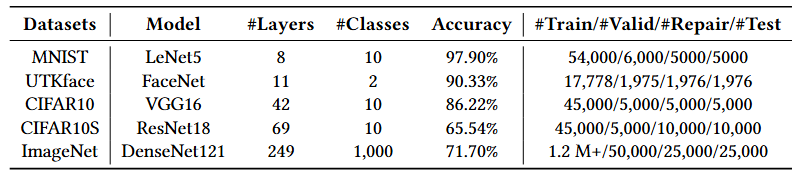
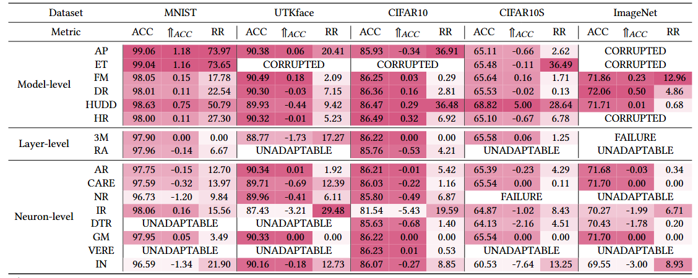
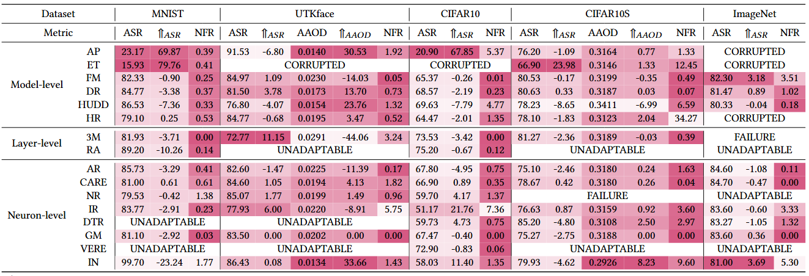
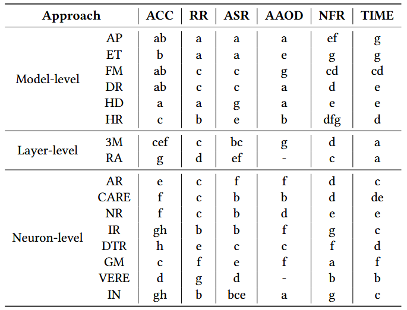
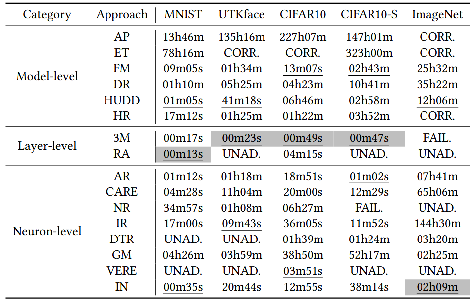

# **Fixing Study**

## **1. Description**

Deep Learning (DL) has been widely adopted in diverse industrial domains, including autonomous driving, intelligent healthcare, and aided programming. Like traditional software, DL systems are also prone to faults, whose malfunctioning may expose users to significant risks. Consequently, numerous approaches have been proposed to address these issues.
In this paper, we conduct a large-scale empirical study on 16 state-of-the-art DL model fixing approaches, spanning model-level, layer-level, and neuron-level categories, to comprehensively evaluate their performance. We assess not only their fixing effectiveness (their primary purpose) but also their impact on other critical properties, such as robustness, fairness, and backward compatibility. To ensure comprehensive and fair evaluation, we employ a diverse set of datasets, model architectures, and application domains within a uniform experimental setup for experimentation.
We summarize several key findings with implications for both industry and academia. For instance, model-level approaches demonstrate superior fixing effectiveness compared to others. No single approach can achieve best fixing performance while improving accuracy and maintaining all other properties. Thus, academia should prioritize research on mitigating these side-effects. These insights highlight promising directions for future exploration in this field.

Due to the file size limit of GitHub, we only uploaded the evaluation code and part of the dataset and the corresponding model to the repository. Later, we will put all the code in some docker containers and upload the containers to the docker repository.


## **2. Structure**

```
|--Fixing Study/
|--|--evaluate.py           : The evaluation code
|--|--datasets.zip          : The dataset
|--|--models.zip            : The original model before fixing
|--|--evaluation_models.zip : The evaluation models after fixing
```


## **3. Datasets**

We selected 5 datasets for empirical research. The table below provides a summary of the datasets, including the models paired with the datasets, the number of model layers, the number of classification tasks, and the accuracy.
In addition, we also show the number of instances used for model training, validation, repair, and testing, following existing research.


<p align="center">
  
</p>

Specifically, the MNIST dataset is used for digit recognition tasks, the cifar10, cifar10s, and imagenet datasets are used for object recognition tasks, and utkface is used for human-centric tasks, where utkface and cifar10s use race and color as sensitive attributes to evaluate fairness, respectively.

**NOTE:** All datasets used in our study could be obtained from their homepages ([MNIST](http://yann.lecun.com/exdb/mnist/), [UTKface](https://susanqq.github.io/UTKFace/), [CIFAR10](https://www.cs.toronto.edu/~kriz/cifar.html), [IMAGENET](https://image-net.org/download-images.php)). Please note that CIFAR-10S dataset used in our study is constructed by [Wang et al.](https://arxiv.org/abs/1911.11834) based on CIFAR-10 dataset.

## **4. Reproducibility**

### **4.1 Environment**

- tensorflow 2.3.0
- scikit-learn 0.20.4
- numpy 1.18.5
- h5py 2.10.0
- foolbox 3.3.3

You can directly use the script below to install the requirements.

```bash
conda create -n fixing_study python=3.6
conda activate fixing_study
pip install tensorflow==2.3.0 scikit-learn==0.20.4 numpy==1.18.5 h5py==2.10.0 foolbox==3.3.3
```

### **4.2 Implementation**

Below is the epsilon parameter when performing PGD adversarial attack on the model.

| Dataset   | epsilon  |
|-------|-------|
| MNIST | 0.15 |
| UTKface | 0.07 |
| CIFAR10 | 0.031 |
| CIFAR10S | 0.035 |
| ImageNet | 0.007 |

### **4.3 Usage**

We provide scripts to evaluate the performance of studied approaches in our study.
Here is a demo and you can run scripts evaluate.py to have a quick start.

```bash
conda activate fixing_study
unzip models.zip
unzip datasets.zip
unzip evaluation_models.zip
python evaluate.py --dataset mnist --model_sturct lenet5 --approach apricot --stat_repair_break True --stat_both_correct True --stat_eval_accuracy True --stat_eval_fairness True --stat_eval_robustness True
```


### **5. Experimental Results**

Please note that all the figures and tables in our paper are based on the results of experiments combined.

The experimental results of RQ1 and RQ2 are listed in the following table.

<p align="center">
  
</p>

The experimental results of RQ3 are listed in the following table.

<p align="center">
  
</p>

<p align="center">
  
</p>

The experimental results of RQ4 are listed in the following table.

<p align="center">
  
</p>
